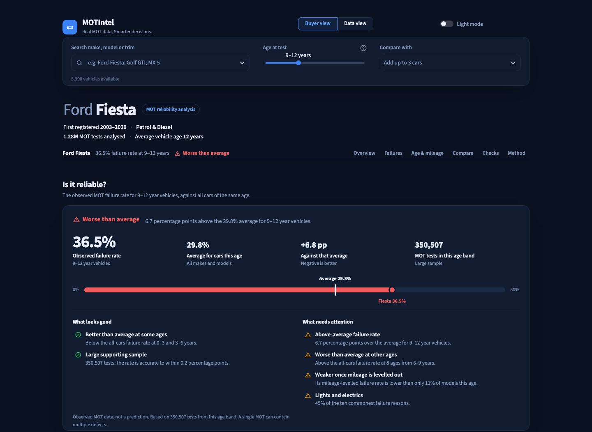
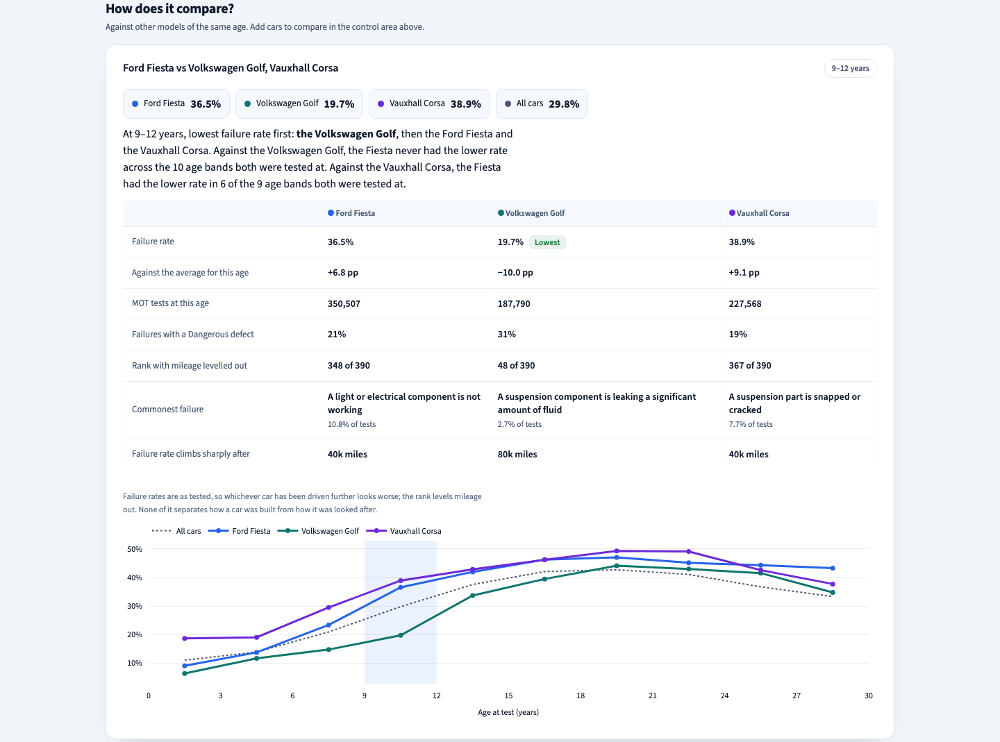

# MOTIntel

**Should you buy that used car? 42.7 million real UK MOT tests, one page of answers.**

Pick a make, model and age. MOTIntel shows how often that car actually fails
its MOT compared with every car the same age, what goes wrong with it, whether
mileage matters, how it stacks up against the cars you're weighing it against,
and a checklist of what to look at when you go and see one. An LLM interprets
the findings — and every answer it gives is checked against the data before
anyone sees it.





---

## Three findings

**1. Old cars fail *less* — because the bad ones are gone.** Failure rate climbs
from 11.0% at 0–3 years to a peak of **42.7% at 18–21 years**, then falls to
33.3% by 27–30. Old cars don't get better: the neglected ones were scrapped, so
what still takes an MOT at 25 is the looked-after minority. Survivorship bias,
measured directly.

| Vehicle age | Tests | Failure rate |
|---|---|---|
| 0–3 years | 1,475,242 | 11.01% |
| 6–9 years | 7,465,670 | 20.91% |
| 12–15 years | 4,874,900 | 37.53% |
| **18–21 years** | 1,858,569 | **42.72%** ← peak |
| 27–30 years | 121,698 | 33.33% |

**2. Machine learning barely beat a simple average, so the app doesn't use it.**
Trained on January–September 2025 and tested on October–December, XGBoost beat a
plain make/model/age average by **0.017 AUC** — and the average was *better
calibrated*. The page shows the observed rate, not a prediction.

| Model | AUC | Brier | Calibration error |
|---|---|---|---|
| Baseline (group-by make/model/age) | 0.6743 | 0.1877 | **0.0058** |
| Logistic regression | 0.6813 | 0.1872 | 0.0173 |
| XGBoost | **0.6910** | **0.1846** | 0.0069 |

**3. Mileage is brutal.** A Ford Fiesta fails 9.8% of tests under 20k miles and
**51.3%** over 120k.

---

## How it works

```
 DVSA open data (8.5 GB of ZIPs)
        │
        ▼
 ① INGEST ─────────► DuckDB raw tables          motintel/ingest.py
        │
        ▼
 ② CLEAN ──────────► 35.4M-row analytical table  motintel/transform.py
        │
        ├──► ③ MODEL COMPARISON (evaluation only) motintel/model.py
        │
        ▼
 ④ EXPORT ─────────► 1.9 MB of Parquet            motintel/export.py
        │
        ├──► ⑤ LLM ENRICHMENT (offline, checked)  motintel/enrich.py
        │
        ▼
 ⑥ FINDINGS ───────► one profile per car          motintel/serving.py
        │
        ├──────────────────────┐
        ▼                      ▼
 ⑦ THE PAGE              ⑧ AI INTERPRETATION ──► checks ──► page
   motintel_app.py          motintel/llm.py          motintel/grounding.py
```

### ① Ingest — get 135 million rows off disk

The DVSA publishes a year of MOT results as ZIPs of monthly CSVs: 42.7 million
tests and 92.5 million defect records. [`ingest.py`](motintel/ingest.py) loads
them into **DuckDB** as-is, with no transformation, so every later step can be
re-run without downloading again.

DuckDB rather than pandas because it reads straight off disk and only
materialises what a query needs — pandas would want all of it in memory. Rather
than Postgres because this is one person running analytical queries on a laptop:
no server, no concurrent writes. The whole load and clean takes **49 seconds**.

### ② Clean — and count everything removed

[`transform.py`](motintel/transform.py) turns raw rows into one row per test,
resolves defect codes through the lookup tables, and works out each car's age.
Every filter is counted and reported, never applied silently:

| Removed | Rows | Why |
|---|---|---|
| Retests | 7,140,990 (16.7%) | A retest answers a different question from a first test |
| No pass/fail verdict | 218,545 (0.5%) | Abandoned or aborted tests |
| Odometer reads 0 | 326,771 → set to *unknown* | 0 means "no reading taken", not zero miles |
| Odometer over 500,000 | 5,395 | Typos |

The files also contradict their own user guide, and each of these would have
quietly corrupted every number downstream:

- **"Pass with Rectification at Station" is a fail.** The car arrived failing
  and was fixed on the spot. Count it as a pass and the car pass rate jumps from
  **72.3% to 81.3%**.
- **Quotes are backslash-escaped**, so the default CSV reader dies on the first
  model name containing a comma.
- **The same defect wording exists with and without a trailing space**, which
  split 43 descriptions in two and listed identical faults twice in the app.
- **Defect categories only resolve through a two-column join** — the failure
  file doesn't carry them.

### ③ Model comparison — a baseline first

[`model.py`](motintel/model.py) compares a plain group-by average with logistic
regression and XGBoost, split **by date** rather than randomly (a random split
puts the same car's January and November tests on both sides and leaks the
answer). The group-by came within 0.017 AUC and was better calibrated — see
finding 2 — so the model is kept as an evaluation, not served.

### ④ Export — heavy work offline, light serving

[`export.py`](motintel/export.py) pre-aggregates everything the page can show —
failure rates by make, model, age and mileage; the ten commonest failure reasons
with how often DVSA graded each one Dangerous; age curves; national averages —
into **1.9 MB of Parquet**. The app never touches the 6 GB database. Groups
under 30 tests are dropped, and ties in a top-ten are broken by name so two
exports always agree.

### ⑤ LLM enrichment — the model as a pipeline tool

DVSA describes a failure as a category plus a fragment: `Suspension` /
`fractured or broken`. A buyer can't tell a £15 bulb from a rotten subframe from
that. [`enrich.py`](motintel/enrich.py) runs once, offline, and turns each of the
**515** fragments behind the app into:

- a plain-English sentence,
- the part of the car it's on (from a fixed list),
- how big the repair is — *small, medium or big job* — kept separate from DVSA's
  severity grade, because worn brake pads are a small job *and* a dangerous
  fault,
- what to physically check when viewing the car, or nothing where it can't be
  seen outside a workshop.

Nothing it writes reaches the app unchecked. [`defect_labels.py`](motintel/defect_labels.py)
rejects the whole table unless every defect is labelled exactly once, every
category comes from the allowed list, no sentence contains a price, mileage or a
figure not in its source, and nine hand-written anchor cases agree. A human then
reads the labels on a review page ([`review.py`](motintel/review.py)), and every
disagreement is committed to [`defect_overrides.json`](motintel/defect_overrides.json).

Batched 50 at a time and cached per batch, so a run fits the free tier's 20
requests a day and resumes where it stopped.

### ⑥ Findings — decided in code, not by the AI

[`serving.py`](motintel/serving.py) builds one profile per car that both the page
and the AI read, so a car can't show one number on screen and another in its
summary. It also works out what the numbers *mean*:

- **Better, about or worse than average**, against every car the same age.
- **How much to trust it**, from the 95% margin of error on the rate.
- **Where on the car the failures cluster**, from the enriched labels.
- **The mileage where failures jump**, if there is one.
- **A like-for-like rank.** Sorted raw, the "most reliable" 12-year-old cars are
  Ferraris and Rolls-Royces — because a 12-year-old Ferrari has done 9,100 miles
  and a Focus 91,700. Each model is re-weighted onto the mileage spread of all
  cars its age, and models without enough spread are left out rather than
  guessed at.

### ⑦ The page — the questions a buyer asks, in order

[`motintel_app.py`](motintel_app.py) is a Streamlit app laid out as five
questions: *Is it reliable? What usually goes wrong? Does age or mileage matter?
How does it compare? What should I check?* A single search box covers all
**5,998** cars; up to three more can be compared, always **at the same age**
(a 4-year-old car against a 12-year-old one mostly measures the eight years).
The car, age and comparison live in the URL, so any view can be shared.

### ⑧ AI interpretation — checked before it's shown

```
 profile ──► data block ──► Gemini ──► structured JSON ──► checks ──┬──► cached + shown
 (facts)     (its whole                                              └──► rejected, not cached
              world)
```

[`llm.py`](motintel/llm.py) gives Gemini a rendered block of the car's figures
and findings — no tools, no web, nothing else. It returns structured JSON
(headline, "should I be concerned?", key points, what to check), which the page
lays out. Before an answer is cached or shown, it's rejected if it:

- contains **a figure that isn't in the data block** ([`grounding.py`](motintel/grounding.py)),
- volunteers **anything outside the data** — a price, a recall, a body type,
  advice to buy or avoid,
- **describes a car with too few tests** instead of declining,
- or **declines a well-covered car** — because a model that refuses everything
  would otherwise pass every other check.

It runs only when you press the button, at temperature 0, and answers are cached
on disk. Retrieval is plain SQL rather than a vector store: the lookup is an
exact make, model and age, and grounding is about the data, not embeddings.

**Measured, not asserted.** [`tests/test_llm_eval.py`](tests/test_llm_eval.py)
re-checks every cached answer against the exact data it was given, without
spending any API quota:

| | |
|---|---|
| Figures checked against their source data | **199** across 18 answers |
| Answers with a figure not in that data | **0** |
| Answers volunteering prices, recalls or buying advice | **0** |
| Well-covered cars answered rather than declined | **10 / 10** |
| Thin-data cars correctly declined | **5 / 6** |

The one miss is kept in the numbers: a 90-test Abarth 595C answer said the data
was too thin, then described the car anyway. It, and most of this set, predates
the current structured format, which checks the refusal explicitly — growing the
evaluation on the current format is the next step.

---

## In numbers

| | |
|---|---|
| MOT tests loaded | **42,728,066** |
| Defect records loaded | **92,473,454** |
| Rows after cleaning | **35,368,333** (82.8% kept) |
| Cars you can look up | **5,998** across 122 makes |
| Full load and clean | **49 seconds** |
| Serving layer | **1.9 MB** of Parquet |

---

## Run it

```bash
python -m venv .venv && ./.venv/bin/pip install -r requirements.txt
# macOS only, for XGBoost: brew install libomp
```

Download the 2025 results, the failure items and `lookup.zip` from the
[DVSA](https://open.data.dvsa.gov.uk/mot-anonymised/index.html) into `data/raw/`
(unzip `lookup.zip` to `data/raw/lookup/`), then:

```bash
./.venv/bin/python -m motintel.run_pipeline   # ① ② ingest, clean, quality report
./.venv/bin/python -m motintel.model          # ③ baseline vs logistic vs XGBoost
./.venv/bin/python -m motintel.export         # ④ the serving layer
./.venv/bin/python -m motintel.enrich         # ⑤ optional: LLM labels for defects
./.venv/bin/python -m motintel.review         #    read the labels before they ship
./.venv/bin/streamlit run motintel_app.py     # ⑦ the app
```

The AI panel needs a free Gemini key in a `.env` file as `GEMINI_API_KEY=…`
([get one here](https://aistudio.google.com/apikey)). Without it, the rest of
the page works and the panel says so. Add `?theme=light` to the URL for the
light theme.

### Tests

```bash
./.venv/bin/python -m tests.test_app_smoke       # drives the real app: 159 cars, every panel
./.venv/bin/python -m tests.test_llm_eval        # measures the AI answers (no API calls)
./.venv/bin/python -m tests.test_llm_grounding   # grounding rules; live half needs a key
./.venv/bin/python -m tests.test_defect_labels   # the enrichment's contract
./.venv/bin/python -m tests.test_enrich          # enrichment machinery (no API calls)
./.venv/bin/python -m tests.test_names           # display names: MX-5, not Mx-5
./.venv/bin/python -m tests.test_short_labels    # short failure-reason labels
```

CI runs lint, an import check and every suite that doesn't need the 17 GB of
source data.

---

## What an MOT failure rate is not

It isn't a reliability score. The MOT checks safety and emissions once a year,
can't see anything repaired in between, and reflects how a car was looked after
as much as how it was built. Fuel type is unreliable for older hybrids, and the
data carries no repair costs. The page says so wherever it shows a figure.

---

## Licence

Code: [MIT](LICENSE) — use it however you like.

Data: contains public sector information licensed under the
[Open Government Licence v3.0](https://www.nationalarchives.gov.uk/doc/open-government-licence/version/3/).
Source: [DVSA anonymised MOT testing data](https://open.data.dvsa.gov.uk/mot-anonymised/index.html).
